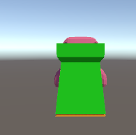

## aan de slag met unity

download dit project:

## game data classes

1) classes gebruiks klaar maken
we hebben 3 classes nodig voor dit project
deze zijn er al onder `Scripts\GameClasses`

open deze 3 in een code editor
- Enemy.cs
- Tower.cs
- RelAdd.cs

zoals je ziet staan er `???` in deze classes vervang deze door de juiste code
`lees het commentaar goed door!`

2) controlleer je werk run de game in unity

