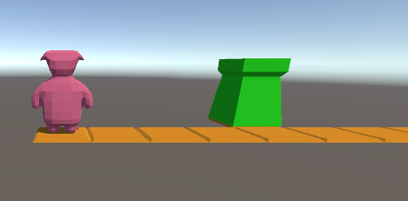

## download

2)
download nu deze `GameEngine.cs` file:

zet deze over je `GameEngine.cs` uit step1 heen!

## dynamisch een level opbouwen en in arrays bewaren

open `Scripts\GameEngine.cs` in een code editor

1)
zoals je ziet staan er `???` in deze class vervang deze door de juiste code
`lees het commentaar goed door!`

2) controlleer je werk run de game in unity

