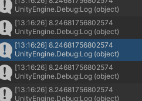

## range check

tijd om te rekenen


## afstand berekenen

Dit is iets wat we heel vaak nodig hebben.

We gaan dat nu in 3d doen.

maak een `function` in `GameEngine.cs`:

- name:   GetDist
- argumenten: (GameObject a, GameObject b)
- return: double

## pytagoras in 3d

plak de volgende code in je `function` in `GameEngine.cs`:
```
        float dx = a.transform.position.x - b.transform.position.x;
        float dy = ???;
        float dz = ???;


        float powered = (dx * dx) + (dy * dy) + (dz * dz);
        double dist = Math.Sqrt(powered);
        Debug.Log(dist);
        return dist;
```

zie je de `???` die moeten nog ingevuld worden
`float dy = ` moet de waarde krijgen van het verschil in `y` tussen `a` en `b`
`float dz = ` moet de waarde krijgen van het verschil in `z` tussen `a` en `b`


## testen

in onze Update zetten we nu deze code om te kijken of de `Enemy` in range van de `toren` is of niet:

```

        //use function oefening
        if (GetDist(tower.obj, enemy.obj) <= tower.detectRange)
        {
            Debug.Log("near!");
        }
```

nu krijg je als het goed is in de console dit te zien:


