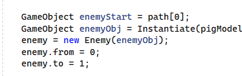
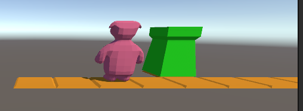

## enemy bewegen langs een pad

tijd om te rekenen en arrays te combineren


## richting berekenen

maak een `function` in `GameEngine.cs`:

- name:   MoveEnemy
- argumenten: (Enemy enemy)
- return: void

## gebruiken

laten we deze meteen in de Update zetten:

`MoveEnemy(enemy);`

## het pad volgen

Enemy heeft 2 `int`s namelijk `from` en `to`

deze hadden we al gezet op van 0 naar 1.
Dit zijn `indexen` van de `path` array 


maar het pad is maar 10 groot.
Eerst zorgen dat we niet voorbij 10 kunnen:


plak de volgende code in je `MoveEnemy function` in `GameEngine.cs`:
```
         if (enemy.to >= path.Length)
        {
            return;
        }
```

mooi nu kunnen we niet crashen

## Objecten uit path halen

plak deze code in je `MoveEnemy function` in `GameEngine.cs`:
`wel onder de code uit de vorige stap`

```
        
        GameObject from = path[???];
        GameObject to = path[???];
```

zie je de `???` daar willen we de `from` en `to` van de enemy gebruiken
probeer dat zelf!


## richting bepalen

we hebben nu een van en naar object. Nu gaan we de richting bepalen:

```

        float dx = to.transform.position.x - from.transform.position.x;
        float dy = to.transform.position.y - from.transform.position.y;
        float dz = to.transform.position.z - from.transform.position.z;

        Debug.Log(dx + " " + dy + " " + dz);
```
zie je de `delta` weer terugkomen? alleen deze keer dan `tussen twee objecten` uit het `path`

## verplaatsen

om `enemy` te verplaatsen volgens het pad kunnen we gewoon de positie aanpassen:

`  enemy.obj.transform.position += new Vector3(dx, dy, dz) * Time.deltaTime;`

plak die code ook in `MoveEnemy`

## testen


nu krijg je als het goed is te zien dat het poppetje beweegt:




