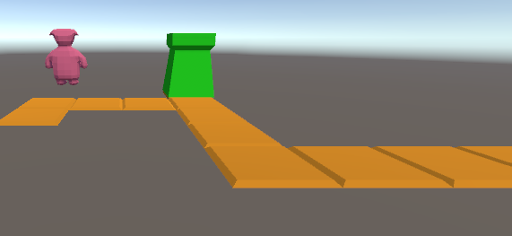

## de hoek om

ok de enemy beweegt maar stopt niet 


## richting berekenen

ga naar de regel ` RelAdd[] pathplus = new RelAdd[10];` in `GameEngine.cs`

daar maken we nu van:
```
RelAdd[] pathplus = new RelAdd[] {

            new RelAdd() {x=0,z=0 },
            new RelAdd() {x=0,z=1 },
            new RelAdd() {x=1,z=0},
            new RelAdd() {x=1,z=0},
            new RelAdd() {x=1,z=0},
            new RelAdd() {x=0,z=-1 },
            new RelAdd() {x=0,z=-1 },
            new RelAdd() {x=0,z=-1 },
            new RelAdd() {x=1,z=0},
            new RelAdd() {x=1,z=0},
            new RelAdd() {x=1,z=0},
        };
```

dit beschrijf het pad ten opzichten van de vorige tegel

## het pad anders aanmaken

1) in `  void Start()` maken we nu 3 lokale `int` variabelen aan:
- `int x = 0;`
- `int z = 0;`
- `int size = 2;`

Dit worden de coordinaten van een `tile`
En die passen we aan per stap van de `for loop`
De `size` is voor de grote per stap de modellen zijn `2` groot


2) vervang 
- `path[i] = Instantiate(tileModel, new Vector3(i * 2, 0, 0), Quaternion.identity);` 
met 
- `path[i] = Instantiate(tileModel, new Vector3(x, 0, z), Quaternion.identity);`

zie je hoe we nu de `x` en `z` gebruiken?


## x en z berekenen

in de for loop gaan we nu naar de `RelAdd` in `pathplus` kijken

1) haal voor de huidige `index` `i` de `RelAdd` op

```

            RelAdd step = ???;
```


2) gebruik nu de `x` en `z` data in `step` om de `x` en `z` in `Start` aan te passen:
```
            x += ???.x * size;
            z += ??? * size;
```

## testen


nu krijg je als het goed is te zien dat je een nieuw pad hebt:




maar de enemy loopt er niet op!
