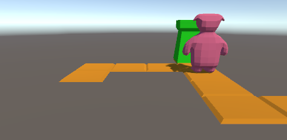

## Woops hij loopt verder


daar waren we nog wat vergeten

We kijken nog niet of de `Enemy` bij de `to` is gekomen

laten we dat nu gaan doen:

1) ga naar de `MoveEnemy` function

2) gebruik nu de `GetDist` function om de afstand tussen `enemy.obj` en `to` te berekenen:
```
        double dist = ???;
        Debug.Log(dist);
```

3) Als dat werkt kan je testen of `enemy` er bijna is:

```
        if (dist <= 0.01)
        {
                Debug.Log("goto next!");
        }
```
4) nu moeten we nog naar de volgende `from` en `to` van enemy
gebruik `++` hiervoor

5) 
voor de netheid zetten we de `enemy` ook even op de `to` waar hij bijna was:

`enemy.obj.transform.position = to.transform.position;`

doe dit in de `if`

## testen


nu krijg je als het goed is te zien dat je een nieuw pad hebt:




maar de enemy loopt er niet op!